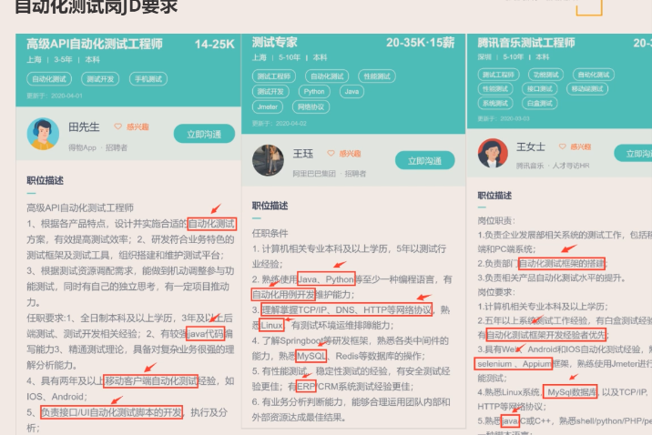
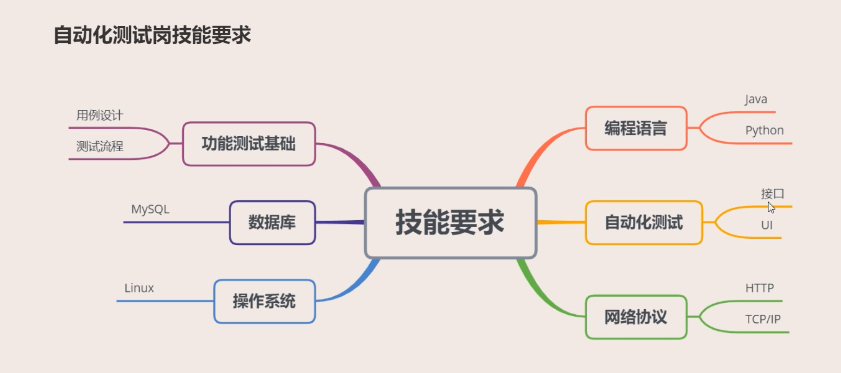

## 自动化测试岗JD要求

## 自动化测试岗技能要求

## 简历编写

1. 简历辅导视频

2. 简历编写规范文档

## 面试前准备

1. 知识点总结归纳
2. 项目熟悉
3. 技术面试题刷题
4. 个人形象

## 个人自我介绍

1. 自我语言表达能力

2. 第一印象&亲和力

从业时间、教育背景、工作经验、项目经验、擅长技能（控制在3分钟以内）

 
参考回答
 
面试官你好，我叫XX，16年从中南大学计算机专业毕业，毕业之后一直在XXX公司从事软件测试工作5年，这家公司做XXX的产品，做一个产品的简单介绍。我主要负责产品功能测试、自动化测试，个人擅长的是接口自动化测试。

## 技术面试

#### * 功能测试基础

1. 公司测试流程/测试工作怎么开展的/怎么展开测试？

   
 
参考答案
 
   首先就是要做需求评审，作为一名测试人员，要先对你所测试的项目有深入的了解，这样才能发掘测试点，编写测试用例； 
   第二就是要编写测试用例，测试用例要应用自己所知道的测试方法，再结合需求的实际场景来编写； 
   第三就是做用例评审（这个不是必需，根据项目大小来看），用例评审听取研发和产品的意见，可能可以发现更多的测试点，完善你的测试用例； 
   第四就是待项目提测后介入测试，根据编写的测试用例去执行用例； 
   第五在执行用例过程后发现了Bug，提交给研发，研发改好了，再进行回归测试； 
   第六在当前功能所有Bug解决（或剩余Bug确认延期）后就会提交到上线前的分支，再在上线前的分支进行系统测试； 
   第七验收测试（如有需要），一般对于一个大的项目来讲，会有多个项目组，每个组都会有自己的开发和测试分支，然后会合并到一个最终分支进行整体测试，然后还会有一个回归测试组专门做验收！ 
   验收测试完成后，进入到第八个步骤：线上冒烟测试，所有功能部署到生产环境后，进行主要功能的冒烟。然后整个测试的流程就算是结束了。
   
2. 如何编写测试用例？/用例设计思路？/测试思路？

   (1) 物品类：水杯、电梯、笔
    水杯：功能特征：
         1、杯子的容量：能装多少水? 空杯，半杯，满杯
         2、型状：圆型 上面口大 下面小
         3、材料：纸质
         ui：广告图案与杯子盛的的液体接触是否掉色
             广告内容与图案是否合法
             广告内容与图案是否容易剥落
         易用：
            装入热水多久可以变温，装入冰水多久可以融化
         兼容安全：装不同的液体 是否发生化学反应 比如可乐 咖啡等饮料
               装入热水杯子是否变型和异味
         稳定：摔一次是否会摔坏，摔多次是否会摔坏

   (2) 简历上的项目XX功能

   (3) 流行的软件产品（淘宝、微信、今日头条）购物车、红包、朋友圈

   

#### * Linux系统

1. 基础日常命令

   
 
参考答案

   ls：查看当前目录文件 
   pwd：显示当前路径 
   cd：进入目录 
   mkdir：创建文件夹 
   touch：创建文件 
   rm：删除文件，递归删除文件夹加 -r参数 
   mv：剪切、重命名 
   copy：复制 
   clear：清除窗口信息 
   cat：查看文件内容 
   gedit：编辑文件 
   grep：检索文件内容 
   find：查找文件 
   chmod：修改权限 
   

2. 如何部署测试环境

   

参考答案

   一般是根据开发给到的部署文档搭建，比如： 
   1）安装所需的软件，如：jdk、mysql、tomcat等 
   2）获取开发打包的项目包（比如war包） 
   3）放置到tomcat的webapps目录下，修改tomcat的配置文件（比如数据库连接信息，日志配置信息） 
   4）启动mysql数据库，建表导入初始数据 
   5）启动tomcat容器 
   

3. Linux系统下怎么查询端口占用（比如：8080）并杀掉占用端口的进程?

   

参考答案

1）首先根据netstat命令查看占用端口对应的进程号 
   netstat -anp | grep 8080 
   2）再通过kill命令杀死对应进程 
   kill -9 进程号 
   

   
4. 日志处理相关

   (1) 如何查看项目的日志，如何查看最近1000行日志

   

参考答案

   一般测试的项目里面，有个 logs 的目录文件，会存放日志文件，一般是以.log为后缀，可以用 tail -f 动态实时查看日志，这时屏幕上会动态实时显示当前的日志，可以使用ctrl+c组合键停止日志输出
   如何查看最近 1000 行日志：
   tail -1000 xx.out
   

   (2) 清除当前tmp目录下及其子目录下所有的*.log文件

   

参考答案

   rm -rf `find ./tmp -name "*.log"` 
   find ./tmp -name *.log | xargs rm -fr 
   
   把*.log 复制到log目录 
   find ./tmp/ -name *.log  | xargs -i cp {} ./logfiledir/  
   在/mnt目录下查找小于100K的文件  
   find /mnt -type f -size -100  
   

   (3) 日志文件每行的格式如下： ip,mac,备注等等，用命令取出ip并统计出来ip重复的次数，倒序排列

   

参考答案

   awk -v FS=',' '{print $1}' test.txt | sort -r | uniq -c
   

   (4) 将文件test.txt中所有的makecache字符串替换为makeclean

   

参考答案

   sed -i 's/makecache/makeclean/g' test.txt
   

5. docker相关
   (1) 如何查看当前运行的容器？
   

参考答案

   docker container ls
   docker container ps
   

   (2) 如何镜像创建Docker容器？
   

参考答案

   docker run -it -d <image_name>
   

   (3) 常用的 Docker 命令？
   

参考答案

      docker pull 拉取镜像
      docker create 创建容器
      docker rm 删除容器
      docker ps 列出正在运行的容器列表
      docker run 创建容器并运行指定命令
      docker start 启动容器
      docker stop 停止运行容器
      docker restart 重启容器
      docker rm 删除容器
      docker exec 容器执行指定命令
      docker rmi 删除镜像
   

   (4) 如何指定容器的端口映射？
   

参考答案

    创建容器时，通过 -p 来指定端口映射 
    创建容器后，通过修改容器的配置文件来指定端口映射 
   

   (5) 如何指定容器的目录映射？
   

参考答案

    创建容器时，通过 -v 来指定目录映射 
    创建容器后，通过修改容器的配置文件来指定目录映射 
   

   (6) docker run 参数详解？
      

参考答案

      命令格式：docker run [OPTIONS] IMAGE [COMMAND] [ARG...] 
      中文意思为：通过run命令创建一个新的容器（container） 
      常用选项说明 
         -d, --detach=false， 指定容器运行于前台还是后台，默认为false 
         -i, --interactive=false， 打开STDIN，用于控制台交互 
         -t, --tty=false， 分配tty设备，该可以支持终端登录，默认为false 
         -u, --user=""， 指定容器的用户 
      

   (7) 如何查看指定容器的log？
   

参考答案

    创建容器时，docker container run -p 10080:80 nginx  
    创建容器后，docker container logs  -f  id 和 docker container attach d6  
    docker logs 用于查看容器运行日志 
    docker logs :用于输出容器的所有日志，需要注意容器的日志总量 
    docker logs --detail:显示详细信息 
    docker logs -t :针对每行日志添加时间戳 
    docker logs -f：跟踪实时日志输出 
    docker logs --tail n :输出倒数N行的日志 
   

#### * 网络协议

1. cookie、session、token区别

   

参考答案

   cookie是一门客户端技术，一般是由服务器生成返回给浏览器客户端来保存的，并且cookie是以键值对的形式保存在浏览器客户端的，每一个cookie都会有名称，值，过期时间...。cookie有很多使用场景，在项目中比较常见的有： 
   　　1.登录记住用户名 
   　　2.记录用户浏览记录 
   Http协议是无状态的，Session是一种让请求从无状态变成有状态的机制，session是服务端的会话技术，当用户登录了系统，服务器端的就会创建一个会话，此会话中可以保存登录用户的信息。 
   

   
2. get/post请求区别

   

参考答案

   Get： 
   a.一般对于从服务器取数据的请求可以设置为get方式 
   b.Get方式在传递参数的时候，一般都会把参数直接拼接在url上（例如:http://xxx?id=1&type=2） 
   c.Get请求方法可以传递的参数数据量是有限的（因为一般参数是拼接在url上，而浏览器对于url的长度是有限制的） 
   d.Get请求因为是直接将数据拼接在url上，所以安全性不如post强（相对），但是get的执行效率要快于post 
   Post： 
   a.一般往服务器提交数据的请求会设置为post方式 
   b.Post方式传递参数一般都会把参数放在请求体，而不会拼接在url 
   c.Post请求方法可以提交的数据量不受限制 
   Post请求传参相对于get要安全（相对不是绝对），但是post的执行效率不如get。 
   

3. TCP/IP三次握手，四次挥手

   

参考答案

    
   三次握手是指建立TCP连接协议时，需要在客户端和服务器之间发送三个包，握手过程中传送的包里不包含数据，三次握手完毕后，客户端与服务器才正式开始传送数据。 
   第一次握手：客户端和服务器都处于CLOSED关闭状态，客户端将标志位SYN置为1，随机产生一个值seq=x，并将该数据包发给服务器，客户端进入SYN-SENT（同步已发送）状态; 
   第二次握手：服务端收到数据包后由标志物SYN=1得知客户端请求建立连接，服务端将标志位SYN和ACK都设置为1，确认号ack = x+1,随机产生一个值seq = y，并将该数据包发送给客户端以确认连接请求，服务端进入SYN-RCVD（同步收到）状态; 
   第三次握手：客户端收到确认后，检查确认号ack是否为x+1，ACK是否为1，如果正确则将标志位ACK置为1，ack = y+1，并将该数据包发送给服务器，服务器检查ack是否为y+1，ACK是否为1，如果正确则连接建立成功，客户端和服务端进入ESTABLISHED（已建立连接）状态，完成三次握手，随后客户端和服务端就可以开始传输数据。 
    
   第一次挥手：客户端发起中断连接请求，也就是发送FIN报文，告诉服务端我的数据已经全部发送完了，如果你还没有准备好，可以继续发送数据。客户端进入FIN-WAIT-1（终止等待1）状态，等待服务端确认； 
   第二次挥手：服务端发送ACK，告诉客户端，请求我收到了，但我还没有准备好，请你等我的消息。这个时候服务端进入CLOSE-WAIT（关闭等待）状态，此时的TCP处于半关闭状态。客户端收到服务端的确认后就进入FIN_WAIT（终止等待2）状态，等待服务端发送连接释放报文段； 
   第三次挥手：服务端没有要向客户端发送的数据了，服务端发出连接释放报文段，服务器进入LAST-ACK（最后确认）状态，等待客户端的确认; 
   第四次挥手：客户端收到服务端发送的连接释放报文段后，对此发出确认报文段，客户端进入TIME-WAIT（时间等待）状态。此时TCP未释放掉，需要经过时间等待计时器设置的时间2MSL后，客户端才进入CLOSED（关闭）状态。

4. OSI七层网络模型

   

参考答案

   第一层：物理层 
   电缆连线连接器，网卡等,物理层的任务就是为它的上一层提供一个物理连接，以及它们的机械、电气、功能和过程特性。 
   第二层：数据链路层 
   交换机,控制物理层和网络层之间的通讯，把网络层的数据分割成物理层可以传输的帧。 
   第三层：网络层 
   路由器,将网络地址翻译成对应的物理地址，并决定如何将数据从发送方路由到接收方，ip协议。 
   第四层：传输层 
   负责建立端到端的连接，保证报文在端到端之间的传输，tcp/udp。 
   第五层：会话层 
   负责建立、管理和终止表示层实体之间的会话连接 
   第六层：表示层 
   数据的解码和编码、加密和解密、压缩和解压缩 
   第七层：应用层 
   负责对软件提供接口以使程序能使用网络服务，http,pop3
   

   
5. 简述http请求过程

   

参考答案

   一、域名解析 
   二、建立连接（TCP三次握手建立连接） 
   三、发起HTTP请求 
   四、服务器响应请求返回结果 
   五、浏览器得到HTML、js、css 
   六、浏览器解析HTML、js、css等资源 
   七、浏览器对页面进行渲染 
   八、断开连接（TCP四次挥手断开连接）
   

#### * 数据库

CRUD

柠檬班题库App刷题

#### * 编程语言与算法

1. 类与对象三大特性？讲讲多态？说说向上转型，向下转型？

   
 
参考答案

   封装、继承、多态 
   用父类类型来接收子类的对象，Java通过方法重写来实现多态。 
   * 通过方法重写，子类可以重新实现父类的的某些方法，使其具有自己的特征 
   * 通过方法重写，相同类型的对象，执行同一个方法表现出不同的行为特征，就称为多态 
   继承关系的类型之间的转换: 
   - 向上转型: 通过父类类型接收子类的对象，这种属于自动转换 
   - 向下转型: 通过子类类型接收父类的对象，这种属于强制转换 
   

2. 重载和重写分别是什么，有什么区别，用在哪些地方？

   
 
参考答案

   重载： 
   同一个类当中有多个名称相同方法，但各个相同方法的参数列表不同（跟返回值无关） 
   应用场景：方法作用一致，但是需要的是不同的参数，比如add(int x,int y)，add(int x, int y, int z) 
   重写： 
   在不同的类当中，并且两者要有继承关系，重写是方法名字和参数的列表是要完全一致的 
   应用场景：父类的方法提供的功能不满足，子类重写可以实现自己想要的功能 
   

3. equals和==区别

   
 
参考答案

   ==比较的是变量的地址是否相等 
   equals比较的是内容是否相等 
   object中equals方法也是用==实现，String类库中重写了equals方法 
   

   
4. TestNG中注解有哪些？

   
 
参考答案

   @BeforeSuite: 此注解的方法会在当前测试集合中的任一测试用例前执行 
   @AfterSuite: 此注解的方法会在当前测试集合中的所有测试程序结束后执行 
   @BeforeTest: 此注解的方法在每个Test执行之前会运行 
   @AfterTest: 此注解的方法在每个Test执行之后会运行 
   @BeforeGroups: 此注解的方法在分组测试的任一测试用例执行之前会运行 
   @AfterGroups: 此注解的方法在分组测试的所有测试用例执行之后会运行 
   @BeforeClass: 此注解的方法会在当前测试类中的任一测试用例前执行 
   @AfterClass: 此注解的方法会在当前测试类中的所有测试用例结束后执行 
   @BeforeMethod: 此注解的方法会在当前测试中的每个方法开始之前执行 
   @AfterSuite: 此注解的方法会在当前测试中的每个方法开始之后执行 
   @Test: 表示一个测试用例 
   

6. 冒泡排序实现

   

参考答案

   1、比较相邻的元素。如果第一个比第二个大，那它们交换，否则不交换。 
   2、对每一对相邻元素做同样的工作，从开始第一对到结尾的最后一对。这样最后的元素就是最大的数。 
   3、针对所有的元素重复以上的步骤，除了已经排过的最后一个元素。 
   4、持续每次对越来越少的元素重复上面的步骤，直到没有任何一对数字需要比较。 

#### * 接口自动化

1. 接口自动化测试框架设计

   

参考答案

   开发语言：Java 
   项目构建工具：Maven 
   测试框架：TestNG管理/执行用例 
   底层接口自动化支持库：RestAssured/HttpClient 
   日志系统：Log4j 
   可视化报表：Allure 
   设计思路： 
   1、用例通过Excel管理，用例编辑方便直观 
      问题：数据量大和协调开发，存储数据库中 
   2、数据驱动DataProvider 
      优点：代码与数据解耦，方便测试用例和数据分离管理  
      测试用例引用 @Test(dataProvider = "datas",description = "注册功能测试")
      @DataProvider
      public Object[][] datas() {
      //1是注册
      Object[][] datas = ExcelUtils.getAPIAndCaseByApiId("1");
      return datas;
      }
   3、参数化设计-解决接口依赖，参考Postman类似设计，将接口依赖数据提取出来存放到全局共享池中，需要时通过引用即可 
      
   4、JDBC操作数据库二次封装，数据库断言更方便 
   5、随机工具类实现，用例前置所需数据方便获取 
   6、log4j日志集成 
   7、集成Allure可视化报表 
   8、Jenkins持续集成 
   

2 依赖第三方数据的接口如何进行测试

   

参考答案

   1、根据第三方接口文档写mock服务 
   2、开发配合写死返回数据 
   3、开发打断点修改接口返回
   

3. 接口自动化数据关联怎么处理的

   

参考答案

   1、将依赖接口返回的需要数据取出来(JsonPath) 
   2、作为参数传给下个接口
   

4. 接口自动化的参数化你是如何实现的?说说你的想法？

   

参考答案

   1、加入前置条件 
   2、将依赖的数据提取出来，作为全局变量做参数化
   

5. 在接口自动化中，如何让token不失效？

   

参考答案

   1、调用登录接口，拿到获取的token 
    通过jsonpath或RestAssured的jspath取出 
     Object token = JSONPath.read(body, "$.data.token_info.token");
   	 setVariableInEnv(body,"$.data.token_info.token","${token}");
   	 setVariableInEnv(body,"$.data.id","${member_id}"); 
   2、将拿到的token放在header中，调用确认登录接口 
   3、确认登录接口调用成功，接口返回信息正常
   

   

#### * UI自动化

1. web/app自动化测试框架设计

   

参考答案

   开发语言：Java 
   项目构建工具：Maven 
   测试框架：TestNG管理/执行用例 
   底层UI自动化支持库：Selenium/Appium 
   日志系统：Log4j 
   可视化报表：Allure 
   设计思路： 
   1、数据驱动DataProvider 
   2、参数化-常量提取（包括页面的URL地址、手机号码密码、打开浏览器配置等）到Constant里面 
   3、测试类共性提取（openBrowser公用方法提取到父类BaseTest），所有测试类都是继承于BaseTest 
   4、Page Object设计模式，页面元素/测试用例解耦，提高后期的可维护性+测试用例读取性 
   5、每一次操作元素之前都等待，提高测试脚本执行稳定性 
   6、页面对象共性提取（智能等待、点击、输入数据、获取元素文本值、属性值、元素是否可见等公用方法提取到父类BasePage），所有的页面对象类都继承于BasePage 
   7、log4j日志记录（BaseTest、BasePage类做记录） 
   8、集成Allure可视化报表 
   9、测试用例失败截图，把截图嵌入到Allure报表中 
   10、用例失败重试 
   11、Jenkins持续集成 

   

参考答案

   开发语言：Python 
   测试框架：unittest管理/执行用例 
   底层UI自动化支持库：Selenium/Appium 
   日志系统：logging 
   可视化报表：Allure 
   设计思路： 
   1、数据驱动DataProvider 
   2、参数化-常量提取（包括页面的URL地址、手机号码密码、打开浏览器配置等）到Constant里面 
   3、测试类共性提取（openBrowser公用方法提取到父类BaseTest），所有测试类都是继承于BaseTest 
   4、Page Object设计模式，页面元素/测试用例解耦，提高后期的可维护性+测试用例读取性 
   5、每一次操作元素之前都等待，提高测试脚本执行稳定性 
   6、页面对象共性提取（智能等待、点击、输入数据、获取元素文本值、属性值、元素是否可见等公用方法提取到父类BasePage），所有的页面对象类都继承于BasePage 
   7、logging日志记录（BaseTest、BasePage类做记录） 
   8、集成Allure可视化报表 
   9、测试用例失败截图，把截图嵌入到Allure报表中 
   10、用例失败重试 
   11、Jenkins持续集成 

   

4. Appium和Selenium区别及它们的关系

   

参考答案

   区别： 
   1、appium是用来实现移动端app的自动化测试，selenium是实现web网页自动化测试; 
   2、appium分为appium代码客户端和appium服务端，服务端有命令行和桌面应用2种，对app的操作请求由appium服务端发送到手机端，通过手机端调用ios/android系统自带的测试框架来完成; 
   3、selenium对网页的操作请求，是由浏览器的驱动程序来操作浏览器完成的。主流的浏览器都有对应的驱动程序。 
   关系： 
   appium并没有重新造轮子，直接延用了selenium的底层通信协议标准，并在它的基础上增加了移动端自动化的通信协议; 
   在代码层面上，也继承了selenium中webdriver; 
   在元素定位上也是继承了selenium的定位类，并在它的基础上添加移动端的定位方法。

5. 元素定位方式，元素定位不到有哪些方面原因

   

参考答案

   1、根据元素 id 定位； 
   2、根据元素 tag 定位； 
   3、根据元素 name 属性定位； 
   4、根据元素 class 属性定位； 
   5、根据元素 text 定位； 
   6、根据 xpath 定位； 
   7、根据 css 选择器定位。 
   元素定位不到的原因： 
   1、页面加载元素过慢，加等待时间 
   2、页面有iframe，需要先跳转入iframe再定位 
   3、元素在新的窗口中，需要切换window 
   4、可能该元素是动态元素，定位方式要优化，可以使用部分元素定位或通过父节点或兄弟节点定位。 
   5、元素定位的表达式写错了。 
   

6. 三大等待、隐式等待与显示等待区别

   

参考答案

   硬性等待、隐式等待、显式等待 
   相同点： 
       都是智能等待，在一定时间范围内不断查找元素，一旦找到立刻执行后续代码，没找到就会一直查找到超时为止 
   不同点： 
       1、显示等待是单独针对某个元素，设置一个等待时间，设置一个查询间隔时间，在等待时间内会按照设置的间隔时间对该元素进行查找，超过设置的等待时间尚未出现则抛异常 
       2、显示等待必须在每个需要等待的元素前面进行声明 
       3、隐式等待是全局的是针对所有元素，设置一个等待时间，在设置的等待时间内，程序会不停检测页面元素是否全部加载完成，加载完成则继续向下，超过设置的等待时间尚未出现则抛异常 
       4、隐式等待只需要声明一次，声明之后对整个drvier的生命周期都有效不用重复声明,程序会一直等待整个页面加载完成 
   

7. 验证码/弹窗处理

   

参考答案

   验证码： 
   1、测试过程中注释掉验证码相关代码 
   2、使用万能验证码 
   3、使用验证码识别技术 
   弹窗： 
   1、ajax弹窗，直接定位元素 
   2、iframe弹窗，切换iframe 
   3、window弹窗，切换window 
   4、alert弹窗，切换alert 

8. 简述Page Object（PO）模式

   

参考答案

   PO模式是page object model的缩写，顾名思义，是一种设计模式，把每个页面当成一个页面对象，页面层写定位元素方法和页面操作方法,脚本对应的page类和真实UI页面一一对应 
   PO模式页面元素和测试代码分开，降低耦合性维护成本低，减少代码冗余
   

9. UI自动化执行不稳定因素有哪些

   

参考答案

   1、界面上无法预测的弹框。页面上经常会根据用户行为推送或者弹出动态的信息，比如版本更新，消息通知，推荐产品等等，当这些弹框出现以后，原来的页面元素会被遮挡，无法被定位，此时可能会造成自动化测试脚本运行错误。 
   2、页面元素的动态变化；主要有两方面的变化，第一方面，前端需求经常发生变化导致前端代码频繁修改，当前端页面变化以后可能会造成之前的元素无法被定位；第二方面，页面可能会根据用户的状态和等级展示不同的页面，或者是这一次访问的数据和下一次会不同。 
   3、随机的页面延迟造成控件识别失败；受限于网络环境和设备状态，自动化代码每次运行时可能会产生随机的超时处理。 
   4、测试数据变更。ui 测试每个用例的测试步骤会有很大的区别，他们不能共享同一套代码逻辑，当测试数据变更时，如果不能及时更新自动化代码，会造成脚本执行出错等问题。
   

10. UI自动化前置数据怎么准备

    

参考答案

    web自动化测试数据需要的前置数据实现方式有很多，大体的原则就是尽量减少成本和复杂度。实际操作可以根据实现的难易程度采取以下措施： 
    1、手工通过UI提前准备好测试数据，比如登录过程中需要的测试账号。这种情况适合在自动化运行过程中不需要频繁修改的数据。 
    2、调用接口得到，当通过页面进行自动化操作从而得到数据的成本比较高时，可以通过调用对应的接口得到数据。 
    3、直接操作数据库得到，如果调用接口不方便，也可以通过直接操作数据库的方式获取。 
    

自动化综合

1. 自动化实施流程

   

参考答案

   1. 评估自动化测试实施可行性 
   2. 根据优先级，和公司人员状况制定自动化测试计划 
   3. 制定自动化测试方案-工具/框架选型 
   4. 搭建自动化开发环境，设计框架 
   5. 自动化脚本的开发 
   6. 自动化测试执行，生成报告 
   7. 测试框架/脚本维护 
   

2. 自动化落地情况如何？

   

参考答案

   1. 自动化用例覆盖率 
   2. 自动化执行频率 
   3. 自动化提高效率体现 
   

3. 自动化实施过程中遇到了哪些问题？

## 项目面试

1. 介绍你的项目

   
 
参考答案
 
       考察你是否具有真实的项目经历？熟悉了解项目业务，先整体后局部，整体量化（项目规模、项目周期、人力成本），然后测试环境，到角色职责 
   案例： 
   这个家校互动类项目，包括家校沟通、发布作业、上课点名、课程表、奖励表、学校动态、发表个人动态功能模块。描述核心业务，项目从今年3月份开始进入立项、设计开发，到5月底完成测试发布上线。我们测试时三个人负责这个项目，我主要负责App端的测试工作，项目中参与需求分析及评审、环境部署、测试用例设计、功能测试及自动化测试、测试结果分析、报告总结工作。

2. 如何保证项目质量的

   
 
参考答案
 
   1、文档管理
   2、用例评审
   3、提测准入

4. 项目中遇到了哪些问题

   
 
参考答案
 
   1、纯功能测试，测试效率低下 
   2、提测质量低 
   3、自动化测试代码编码规范 
   4、需求变化频繁，自动化维护量大 
   5、文档管理问题

5. 项目有哪些成果/收获

   
 
参考答案
 
   1、质量方面 
   2、效率方面 

## 终面

1. 职业规划

   

参考点

   1. 走技术路线---功能，性能，自动化测试---全能型资深测试； 
   2. 管理路线  ---测试负责人（测试项目），测试组长，测试经理，测试总监； 
   3. 短期： 先熟悉产品业务，能够胜任测试；搭建自动化框架-----单挡一面，负责项目 
   避免： 转岗---开发，产品经理  运维 ---不要再面试的时候
   

3. 期望薪资

   

参考点

       注意：千万不要好高骛远，可以参考以下几个建议（都要提前去准备）： 
   1、看一下面是公司的招聘岗位薪资 
   2、看一下自己所在城市，对应自己岗位级别的平均薪资 
   3、可以去看准网等一下网站平台了解一下该公司的薪资水平 
   4、10K以下不要说区间，10K以上可以说2-3K的区间，比如：10-12 
   5、不要说公司不会亏待我，由公司来决定给多少要多少的话，直接大方的说出自己要多少就好了 
   

3. 个人性格

4. 离职原因

5. 加班

